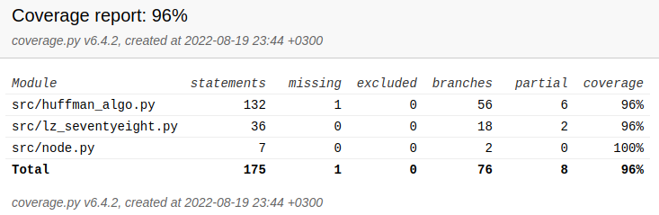

# Testausdokumentti

Unittestin avulla on suoritettu automatisoidusti ohjelman yksikkö- ja integraatiotestausta. Tämän lisäksi järjestelmätason testaus on tehty manuaalisesti.

## Yksikkö- ja integraatiotestaus

### Sovelluslogiikka

index.py -moduulia, joka nyt vastaa sovelluslogiikasta on toistaiseksi testattu vain manuaalisesti erilaisilla tekstitiedostoilla pakkaamista ja niiden pakkausten purkamista. Virheiden mahdollisuutta tai käsittelyä ei ole vielä huomioitu tai testattu.

### Huffman pakkauksesta vastaava luokka

Huffman pakkauksesta vastaava luokkaa `HuffmanAlgo` ja sen käyttöön tarvittavaa `Node` -luokkaa testataan yksikkötestein luokalla [TestHuffmanAlgo](https://github.com/ereborinkorppi/tiralabra/blob/main/src/tests/huffman_algo_test.py). Yksikkötestejä voisi tehdä enemmänkin eri välivaiheille vaikka luokan testikattavuus on hyvä.

### Testikattavuus

Testauksen haarautumakattavuus on 84% (käyttöliittymää/sovelluslogiikkaa ei ole testattu yksikkötestein, vaikka se onkin raportissa mukana).

## Järjestelmätestaus

Sovelluksen järjestelmätestit on suoritettu manuaalisesti.

### Asennus

Sovelluksen alustusta ja testausta ei ole vielä suoritettu oman koneen ulkopuolella. Yliopiston Linux -ympäristöllä testaus on vielä tarkoitus tehdä.

Erilaisia konfiguraatioita ei ole testattu.