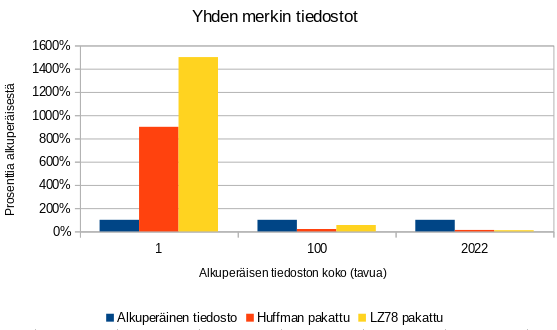
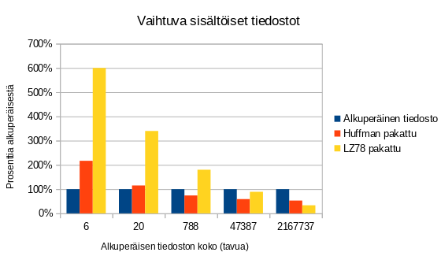

# Toteutusdokumentti

## Ohjelman yleisrakenne

Ohjelman käyttöliittymästä ja sovelluslogiikasta vastaa index.py, täällä tapahtuu tiedostojen lukeminen ja kirjoittaminen. Huffman pakkaus/purku -algoritmia varten on oma luokka [HuffmanAlgo](https://github.com/ereborinkorppi/tiralabra/blob/main/src/huffman_algo.py) ja Lempel Ziv 78 pakkaus/purku -algoritmia varten on oma luokka [LzSeventyeight](https://github.com/ereborinkorppi/tiralabra/blob/main/src/lz_seventyeight.py). Lisäksi Huffman algoritmin puun toteuttamista varten on luokka [Node](https://github.com/ereborinkorppi/tiralabra/blob/main/src/node.py).

## Saavutetut aika- ja tilavaativuudet

## Suorituskyky vertailu pakkausten osalta

Pakkauskykyä on vertailtu eri kokoisilla vain yhtä merkkiä sisältävillä tiedostoilla, sekä sisällöltään vaihtuvilla eri kokoisilla tiedostoilla.

Pienillä tiedostoilla kummassakkaan tapauksessa pakkauksesta ei ole hyötyä. 

- Vain yhtä merkkiä sisältävillä tiedostoilla saadaan hyötyä jo nopeasti. Suhteellisen pienillä tiedostoilla Huffman algoritmi on tehokkaampi, mutta nopeasti tilanne kääntyy LZ78:n eduksi.
- Vaihtuvasisältöisillä tiedostoilla aika pienelläkin tiedostolla Huffman algoritmi on jo hyödyksi, kun taas LZ78 "pakkaus" on yhä alkuperäistä suurempi. Kun mennään suuriin tekstitiedostoihin kääntyy tehokkuus LZ78:n eduksi tässäkin tapauksessa.

Äkkiseltään näiden kokeilujen pohjalta voisi sanoa, että Huffman algoritmi antaa hieman aiemmin pakkaushyötyä, mutta LZ78 pakkaa huomattavasti pienempään tilaan kun tiedostokoko kasvaa riittävän suureksi.

## Työn puutteet ja parannusehdotukset

- Mikäli pakattava tiedosto sisältää muitakin kuin utf-8 perusmerkkejä tulee ongelmia joko LZ78 pakkauksen kanssa, tai Huffman Algoritmilla purun kanssa. Tämä on selkeä virhe ohjelmassa nyt.
- Huffman algoritmin voisi varmasti suorittaa tehokkaamminkin. 
- Vaikka käyttöliittymään on otettu virhekäsittelyä, ei tiedostoja oikeasti tarkasteta, että onko pakkaustekniikka ollut se millä yritetään purkaa.

## Lähteet

- https://towardsdatascience.com/huffman-encoding-python-implementation-8448c3654328
- https://en.wikipedia.org/wiki/Huffman_coding
- https://en.wikipedia.org/wiki/Lempel%E2%80%93Ziv%E2%80%93Welch
- https://medium.com/swlh/how-data-compression-works-exploring-lz78-e97e539138